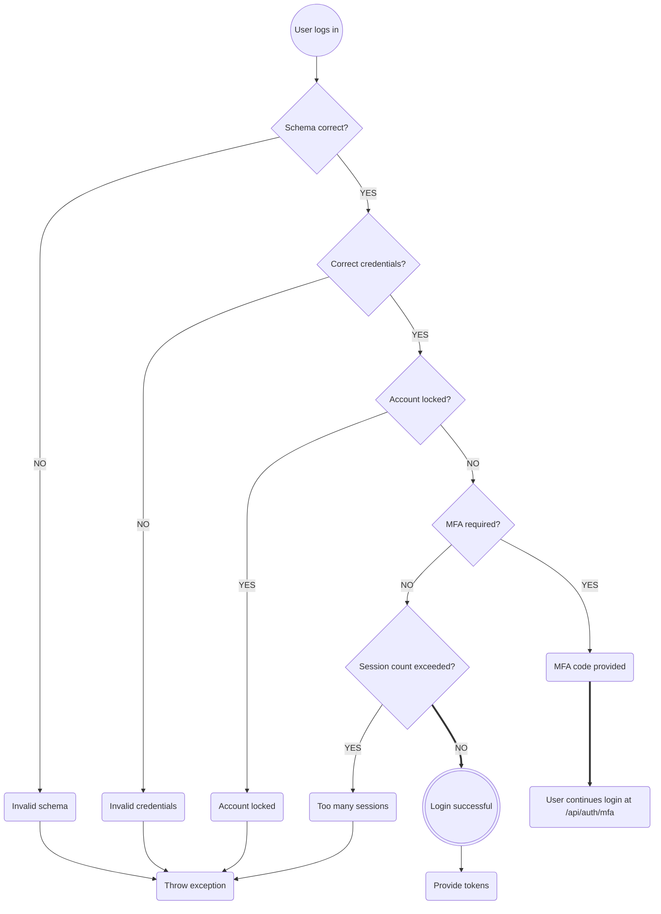
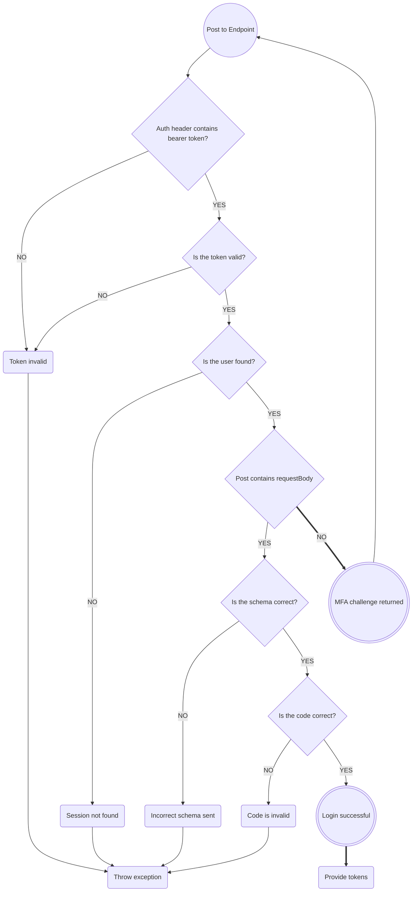

# Authentication

<div style="display: grid; grid-template-columns: 1fr 1fr; gap: 20px">
<div>

### User login (/api/auth/login):

- When the user logs in, ensure that the provided schema is correct.  It should look like this:

  ```json
  {
    "username": "<username|email>",
    "password": "<password>"
  }
  ```

- If the schema is invalid, return an HTTP 400 status, with a VALIDATION_ERROR code.
- If the user is not found, or the password is invalid, return an HTTP 401 status with an
  INVALID_CREDENTIALS code.
- If the user's account is currently locked, return an HTTP 401 status with an 
  INVALID_CREDENTIALS code.
- If the user has required MFA on their account, a response containing the
  MFA code and available endpoints is returned:

  ```json
  {
    "status": "MFA_REQUIRED",
    "details": {
      "mfa_token": "<token>",
      "methods": [
        {
          "type": "sms",
          "endpoint": "/api/auth/mfa?type=sms"        
        }
      ]
    }
  }
  ```
- If the user has too many active sessions, return an HTTP 403 status with a
  TOO_MANY_SESSIONS code. The error details will include a temporary code that
  will allow the user to delete some active sessions.
- If all of the above checks pass, the user will be logged in, a new session
  will be created, and access and refresh tokens will be generated and returned
  in the `body.details` field:

  ```json
  {
    "status": "AUTHENTICATED",
    "details": {
      "access_token": "<token>",
      "refresh_token": "<token>"
    }
  }
  ```
- To access any protected resource in the system, the user must provide the access
  token in the Authentication header as follows:

  ```
  Authentication: Bearer <access_token>
  ```
- Access tokens will expire after 15 minutes. Users can get a new access token by
  hitting the /auth/refresh endpoint.

</div>
<div>



</div>
</div>

### MFA Login (/api/auth/mfa?type=\<type\>):

<div style="display: grid; grid-template-columns: 1fr 1fr; gap: 20px">
<div>

- If the MFA type needs to send the user a code (such as with SMS), it
  can be accessed via POST request with the MFA token provided
  in the Auth header:

  ```
  Authentication: Bearer <mfa_token>
  ```

  A sample response is provided below:

  ```json
  {
    "status": "MFA_CHALLENGE_SENT",
    "details": {
      "type": "sms",
      "destination": "+1-***-***-3224",
      "expires_in": 300,
      "retry_after": 30
    }
  }
  ```

- If the endpoint is hit again with the same type and bearer token
  before the retry_after period has expired, an error will be 
  returned with HTTP status 429, and the code "MFA_RATE_EXCEEDED"
- If the token is malformed, the api will return an error with HTTP
  status 401 and code "INVALID_TOKEN"
- If the token is valid, but the user ID referenced in the sub claim
  is not found, the api will return an error with HTTP status
  401, and code "SESSION_NOT_FOUND"
- Once the user receives the code (either by sending a POST request
  to the endpoint to generate the code, or in the case of TOTP, by
  using an external authenticator app), they can log in by sending
  a POST request to the endpoint with the mfa_token passed as a 
  bearer token in the auth header:

  ```json
  {
    "code": "<code>"
  }
  ```

- If the code is invalid, the api will return an error with HTTP
  status 401, and code "INVALID_CREDENTIALS"
- If the code is valid, the server will complete the login
  and return the following payload with a 200 status:

  ```json
  {
    "status": "AUTHENTICATED",
    "details": {
      "access_token": "<token>",
      "refresh_token": "<token>"
    }
  }
  ```

</div>
<div>



</div>
</div>